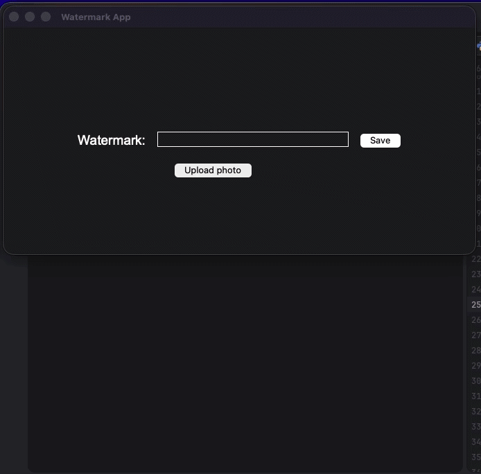

# 🖼️ Watermark Dekstop App Creator
Lightweight, dekstop application built with Python. This tool allows users to upload images and apply custom watermarked text. Image exports to local drive

## 🛠 Tech Stack
* **Python** 
* **Tkinter** 
* **Pillow (PIL)** 

## ✨ Key Features
- **Easy Image Upload:** Load any image file using a file explorer.
- **Custom Text Watermarks:** Type your own text to stamp it across your photo.
- **Quick Export:** Save your watermarked image in various formats (PNG, JPEG, BMP).

## 🧭 The Process
Using graphic design and coding, I wanted to create a practical tool for securing artworks.
While tkinter is doing basic interactions and hold interface, real magic happend with the Pillow library. I programmed the application to read the image data, resize the canvas and use `ImageDraw` to stamp text directly on the image. 

## 🚀 Running the Project
1. Clone this repository.
2. Ensure you have the required image processing library installed:
   ```bash
   pip install pillow
   ```
3. Place a `arial.ttf` in the project folder.
4. Run the script:
   `python main.py`
## 🎞️ Preview

